  <!-- Rainbow animated text with each character a different color -->
  

    
  

## 👀 Peek at Some of My Work

<table>
  <tr>
    <td>
      <h3>🚀 <a href="https://github.com/daaimah123/skills_matrix">Skills Matrix</a></h3>
      
Career therapy for confused techies! Map what you're good at vs. what you enjoy, find your superpowers, and stop having existential crises during standup. Because "follow your passion" is terrible advice!

      

        
        
        
        
        
        
        
      
      

    </td>
    <td>
      <h3>📝 <a href="https://github.com/daaimah123/Daaimah_Portfolio">Portfolio App</a></h3>
      
Quick peek into my technological background and skillset

      

        
        
        
        
        
      
      

    </td>
  </tr>
  <tr>
    <td>
      <h3>👩🏽‍💻 <a href="https://techtonica.org/">Techtonica Website</a></h3>
      
Maintained and enhanced website functionality since August 2023, implementing new features while ensuring stability through regular updates and rapid resolution of critical issues. Collaborated with stakeholders to align technical solutions with business requirements and improve overall site performance.

      

        
        
        
        
        
        
        
        
        
        
        
      

    </td>
    <td>
      <h3>🚸 <a href="https://github.com/daaimah123/Parent-TimeSwap">Parent TimeSwap</a></h3>
      
A space for parents to build an instant network of local parent support towards goals (i.e. school, interviewing, work, conferences, mental health break) by viewing the time availability of local parents, and setting up playdates to determine whether their families are a good fit to help one another during the available times listed.

      

        
        
       
        
        
        
        
        
        
      

    </td>
  </tr>
</table>

<!-- Technology Badges
        
        
        

        
        
        
        
        

-->

## 📊 Tech Deets

  <!-- GitHub Stats Cards with visual separation -->
  

    
    
  

   
  <!-- GitHub Trophies with visual separation -->
  

    
  

<!-- Skills section in a more natural flowing layout -->

  <h3>💻 Languages & Frameworks</h3>
  

    
    
    
    
    
    
  

  

    
    
    
    
    
    
    
  

  <h3>🗄️ Databases & Infrastructure</h3>
  

    
    
    
    
    
    
    
  

  <h3>🔧 Tools & Practices</h3>
  

    
    
    
    
    
    
  

  

    
    
    
    
    
    
    
  

## 🦄 Current Inspirations

  <!-- Using HTML attributes and inline CSS to completely remove borders -->
  <table cellspacing="0" cellpadding="0" border="0" style="border-collapse: separate; border-spacing: 15px; border: 0; box-shadow: none;">
    <tr style="border: 0; background: none;">
      <td align="center" style="border: 0 !important; background: none; box-shadow: none; padding: 15px; vertical-align: top; width: 33%;">
        
         
        <strong>🎶 Favorite Listening Stations</strong>
         
        <a href="https://tidal.com/browse/playlist/cd604f0e-ffc7-40dc-a5ad-e7f5a12ba61d"> CompassPoint: Energy/Time Playlist </a> • <a href="https://www.pandora.com/station/play/4149682030681786046"> Native American Flute Music</a> • <a href="https://www.pandora.com/station/play/117560884900936441"> Family Reunion Beats</a>
      </td>
      <td align="center" style="border: 0 !important; background: none; box-shadow: none; padding: 15px; vertical-align: top; width: 33%;">
        
         
        <strong>🧠 Learning Now</strong>
         
        Technical Project Management • Acrylic Painting • Baking Bean Pies
      </td>
      <td align="center" style="border: 0 !important; background: none; box-shadow: none; padding: 15px; vertical-align: top; width: 33%;">
        
         
        <strong>📚 Currently Reading</strong>
         
        <a href="https://www.hoopladigital.com/series/glass-and-steele/4388278278"> Glass & Steele Series by C.J. Archer </a>• <a href="https://www.hoopladigital.com/series/binti/2823804653">Binit Series by Nnedi Okorafor</a> • <a href="https://www.hoopladigital.com/series/kay-scarpetta/1402474160"> Kay Scarpetta Series by Patricia Cornwell</a> 
      </td>
    </tr>
  </table>

## 👋🏾 Connect with Me!

  

    
    
    
  

<!-- Random Fun Fact in Wave Footer -->

